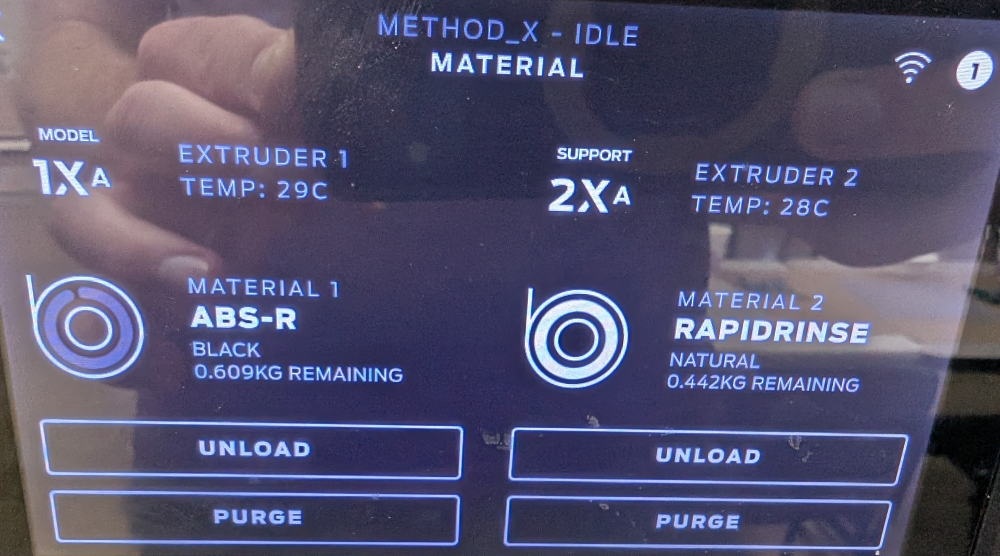
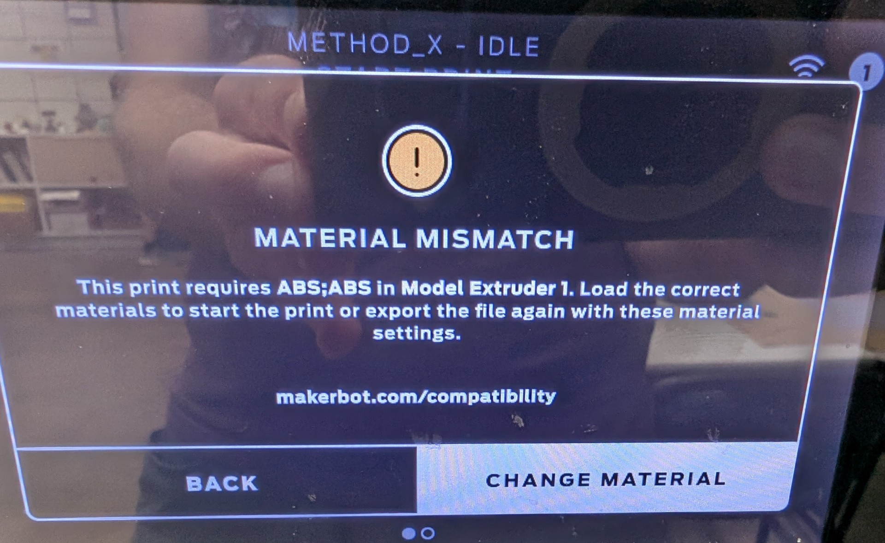
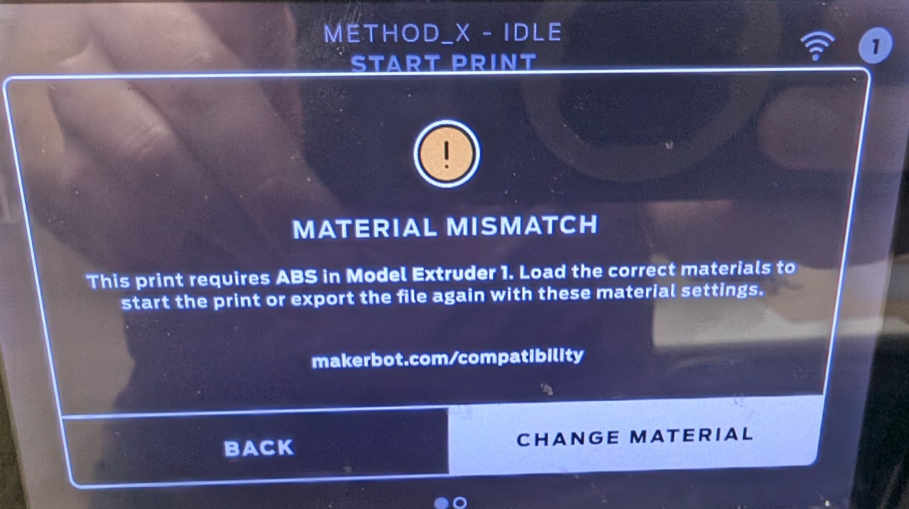
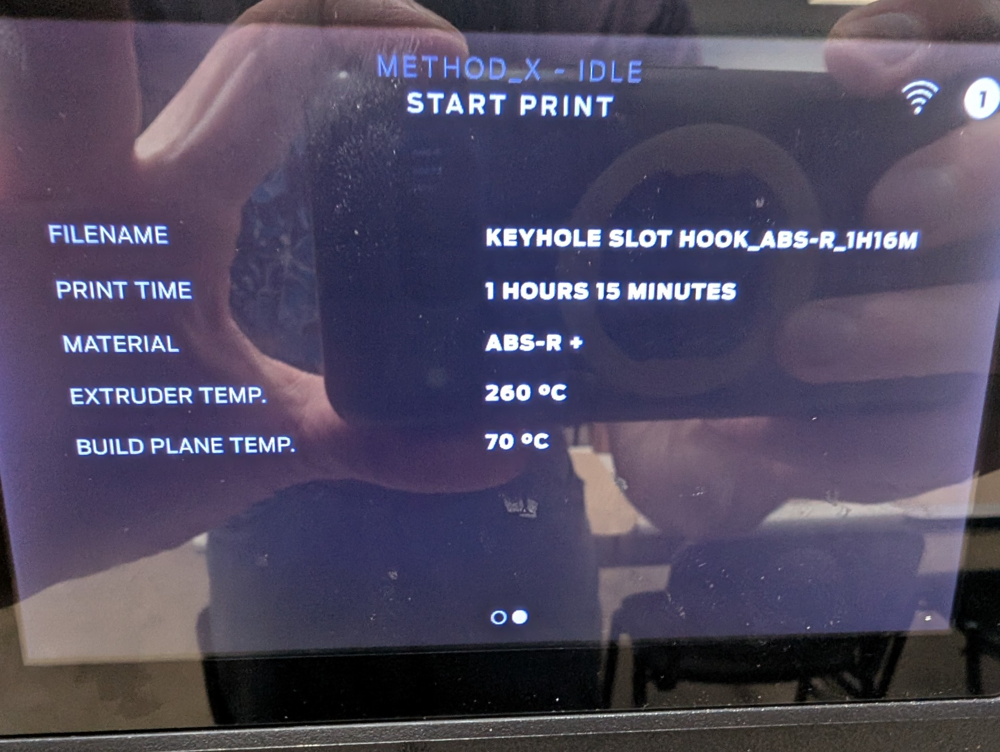
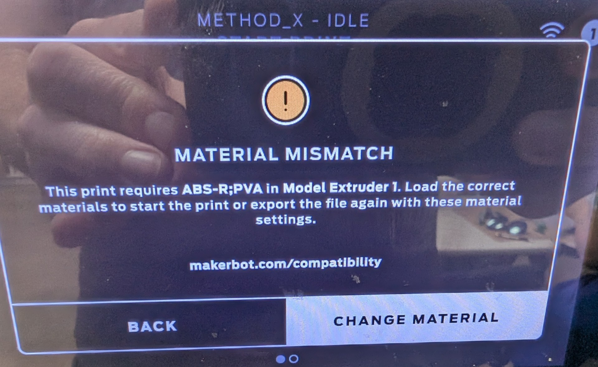

# Test Report - Method X

I am pretty new to this machine - one was donated to our makerspace, and I am trying to make it work.

## Hardware Configuration

- Makerbot Method X
- Extruders: 1XA, 2XA
- Filament loaded: Makerbot ABS-R, Makerbot RapidRinse

## Software Configuration

- Windows OrcaSlicer portable release
  - default OrcaSlicer WAS installed on this machine as well...
- Add Printer -> Method X
- Add all Generic Filaments for that printer
 
### Slice 1 - defaults to ABS/ABS:

- Material not recognized. Seems to want BOTH configured filaments in extruder 1.

### Slice 2 - Custom single-filament 

- Modified printer profile to have 1 extruder, and set to ABS. Material not compatible, as ABS-R is loaded.

### Slice 3 - Custom single-filament ABS-R

- Created a custom filament profile with ABS-R as the type. Same result on the screen - incompatible material.
- It seems like there is a dangling '+' but I don't quite know what to expect from the print properties.

### Slice 4 - Back to default printer profile, with custom filament profile:

- Again seems to want both materials on extruder 1.

